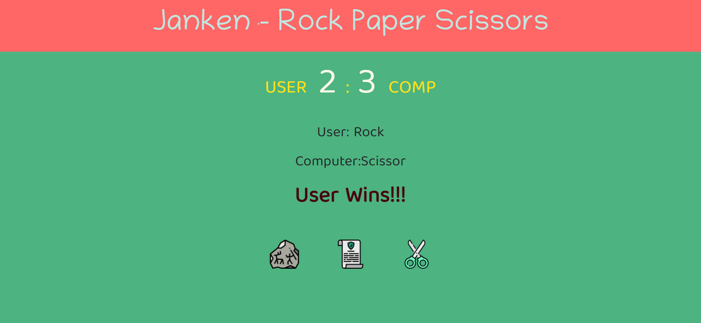
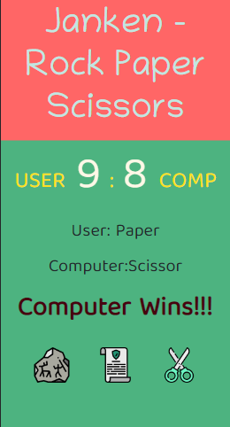

# Rock-Paper-Scissors

## Table of Contents
* [Overview](#overview)
* [Process](#process)
* [References](#references)
* [Author](#author)

## Overview
> Janken or widely known as rock-paper-scissors is a game played between 2 people, but played between computer and user in this project.

### Screenshots
#### 1) Desktop

#### 2) Mobile  

### You can watch Live demo [_here_](https://rock-paper-scissors-5btx.vercel.app/).

## Process

### Built With
- HTML
- CSS
- Tailwind CSS
- JavaScript

### What I Learned
- Firstly, I made a function which returns random computer selection from given array of rock, paper, and scissor. Once user makes selection out of three choices respective event listners run and according to conditions, winner is decided between user and computer. 
- If choices are same game is tied. Winner gets 1 point and is displayed on screen and game continues.

## References
- [TailwindCSS](https://tailwindcss.com/)
- [MDN](https://developer.mozilla.org/en-US/)
- [w3schools](https://www.w3schools.com/)
- [JavaScript](https://javascript.info/)

## Author

[Website](https://kedarmakode.com/)

[Linkedin](https://www.linkedin.com/in/kedar-makode-9833321ab)

[Twitter](https://twitter.com/Kedar__98)

[Instagram]()

kedarmakode1598@gmail.com
